# kmd — Knowledge Markdown

[](https://www.npmjs.com/package/create-kmd)


A knowledge base in plain markdown inspred by Karpathy's
[LLM-wiki pattern](https://gist.github.com/karpathy/442a6bf555914893e9891c11519de94f) and 
made compatible with any coding agent. Designed for Obsidian as a first-class use case.

You drop in articles, papers, meeting notes, whatever — the agent turns them into small,
linked pages that say where every fact came from, and checks the whole thing
regularly so it stays trustworthy. Works with Obsidian, and with any agent
that reads the [Agent Skills standard](https://agentskills.io).

It's the companion to [qmd](https://github.com/tobi/qmd): **qmd searches
your markdown knowledge base, kmd keeps and manages it.**

Built for personal knowledge bases first. If you're running a team of agents
that share one KB, there's an [extension](#extensions) for that.

## How it works

Your KB is a folder of markdown files with a few simple rules:

- **`sources/`** holds raw material exactly as it arrived. Nothing in here
  is ever edited — it's what pages point back to when you want to check a
  claim.
- **Pages** live next to it (`concepts/`, `entities/`, `projects/`, …).
  Each page condenses what the sources say, links to related pages, and
  lists its sources in frontmatter. Filenames are the titles — Obsidian
  shows them everywhere — so a page is called
  `GPU memory math for LLMs.md`, not `gpu-memory-math-for-llms.md`.
- **`INDEX.md`** lists every page with a one-liner (a script generates it),
  **`LOG.md`** records every change, and **`SCHEMA.md`** spells out the
  rules for your particular KB.

Two skills teach any agent to work this way:

- **kmd-ingest** — how to write. Check whether a page already exists before
  making a new one, condense instead of copy, link related pages, cite
  sources, log the change, refresh the index. Ships with small scripts that
  validate each page and keep the log format consistent.
- **kmd-lint** — how to check. A script catches the mechanical problems
  (broken links, missing fields, sources no page cites, a stale index),
  then the agent reads for what a script can't see: pages that contradict
  each other, claims that have gone stale, near-duplicates worth merging.

Three ready-made agents use them:

- **kmd-operator** — ask it questions, it answers from the KB with
  citations; ask it to save something, it does the full ingest.
- **kmd-intake** — turns whatever you dropped into `sources/` into pages.
- **kmd-librarian** — the periodic check-up. Fixes what's safe to fix,
  writes up the rest.

Two small hooks keep agents honest: one blocks edits to files nobody should
hand-edit (`INDEX.md`, `LOG.md`, existing sources), the other checks every
page right after it's written and sends any problems straight back to the
agent. Shell-level writes aren't intercepted on purpose — catching those is
lint's job.

### Architecture

Humans use `kmd-operator` as the single KB entry point. It handles interactive
queries and writes, and delegates batch intake or health work to the backgroundlimitations
agents. Scheduled runs invoke those workers directly.



## Quick start

```bash
npx create-kmd
```

walks you through everything: creates the KB (in a new folder or inside your
Obsidian vault), sets up git, installs the plugin into whichever agent CLIs
it finds, and wires up qmd search. Sensible defaults, every step skippable,
safe to re-run.

Or by hand:

```bash
# a new folder
mkdir -p ~/notes/knowledge/sources
cp skills/kmd-ingest/references/schema-template.md ~/notes/knowledge/SCHEMA.md
printf '{"root": "knowledge"}\n' > ~/notes/.kmd.json   # only needed when the folder isn't named kb/

# or inside an obsidian vault — the KB is just a folder in it
VAULT=~/Obsidian/MyVault
mkdir -p "$VAULT/kb/sources"
cp skills/kmd-ingest/references/schema-template.md "$VAULT/kb/SCHEMA.md"
```

The rest of your vault stays out of it: daily notes and attachments are
untouched, `.obsidian/` and other dot-folders are ignored, and wikilinks
between KB pages and the rest of the vault work both ways. You *can* make
the whole vault the KB by putting `SCHEMA.md` at the vault root — but then
every scratch note is held to the page rules and lint will complain about
them, so the folder-in-vault setup is the right default.

Then, in a session:

```text
drop raw material into <kb>/sources/
"ingest the new sources"        → kmd-intake turns them into pages
"what do we know about X?"      → kmd-operator answers with citations
"run a KB health check"         → kmd-librarian does a full pass
```

## Where kmd looks for your KB

Nothing is tied to a fixed path. Scripts and hooks find the KB in this
order: an explicit `--kb <path>`, the `$KMD_ROOT` env var, or walking up
from the current directory until they hit a `.kmd.json`, a folder containing
`SCHEMA.md`/`LOG.md`, or a `kb/` folder.

The optional `.kmd.json` sits in the folder above your KB:

```json
{
  "root": "knowledge",            // KB folder name (default "kb")
  "report_dir": ".lint",          // where lint reports go, relative to the KB
  "qmd_update_on_ingest": true    // refresh qmd's search index after every ingest
}
```

`INDEX.md` is regenerated by `recompile_index.py` (ships with kmd-ingest,
runs as the last step of every ingest). Nobody edits it by hand — the guard
hook blocks that, and lint flags it when it's missing or out of date.

## Install — Claude Code

```bash
claude plugin marketplace add yasik/kmd
claude plugin install kmd@kmd
```

Or to try it from a local clone:

```bash
claude --plugin-dir path/to/kmd
```

Skills show up as `/kmd:kmd-ingest` and `/kmd:kmd-lint`; the agents as
`kmd:kmd-operator`, `kmd:kmd-librarian`, and `kmd:kmd-intake` — used
automatically, or @-mention them.

## Install — OpenAI Codex

```bash
codex plugin marketplace add yasik/kmd   # or: add ./ from a local clone
```

Codex plugins can't bundle agents yet, so copy the definitions over:

```bash
cp codex/agents/*.toml ~/.codex/agents/      # personal
# or <repo>/.codex/agents/ for one project
```

A few Codex specifics: the guard hook reads Codex's `apply_patch` format on
a best-effort basis, the after-write validator is Claude-only for now, and
project hooks only load once you've trusted the `.codex/` directory.

## Other agents — Cursor, Amp, opencode, pi, Hermes, Grok

The two skills work in any harness that reads the Agent Skills standard.
The extras — bundled agents, the guard hook, qmd over MCP — vary:

| | Skills | Agents | Guard hook | qmd via MCP |
|---|---|---|---|---|
| **Cursor** | ✓ plugin / `.agents/skills/` | ✓ (bundled, same format) | ✓ bundled (`preToolUse`) | ✓ `~/.cursor/mcp.json` |
| **Amp** | ✓ `.agents/skills/` | ✗ (code-only subagents) | plugin adapter below | ✓ `amp.mcpServers` |
| **opencode** | ✓ `.agents/skills/` | ✓ `.opencode/agents/` (copy from `agents/`) | plugin adapter below, or `permission` config | ✓ `opencode.json` `mcp` |
| **pi** | ✓ `.agents/skills/` | ✗ (no subagents, by design) | extension adapter below | ✗ — agents run the `qmd` CLI directly |
| **Hermes** | ✓ `~/.hermes/skills/` | ✗ (delegation only) | ✓ shell hook, works as-is | ✓ `config.yaml` `mcp_servers` |
| **Grok** | ✓ plugin (`.grok-plugin/` in this repo) | ✗ | ✗ | — |

(A `.skillignore` at the repo root keeps skill installers to just the two
skills — they won't drag in the dev tooling or plugin files.)

The installer detects these and installs the skills for you; by hand it's
the [`npx skills`](https://github.com/vercel-labs/skills) CLI:

```bash
npx skills add yasik/kmd --skill kmd-ingest --skill kmd-lint -a cursor -g
# -a values: cursor · amp · opencode · pi · hermes-agent
```

Cursor gets the full plugin (skills, agents, and the guard hook) through its
own manifest in this repo — install it from the Cursor Marketplace once
published, or symlink the repo into `~/.cursor/plugins/local/kmd`.

**The guard hook elsewhere.** `kb_guard.py` reads the same JSON everywhere
and answers in whichever format the calling harness expects (Claude/Codex,
Cursor, or Hermes). For Hermes it works as a plain shell hook:

```yaml
# ~/.hermes/config.yaml
hooks:
  pre_tool_call:
    - command: "python3 <plugin>/hooks/scripts/kb_guard.py"
```

opencode can get most of the protection with no code at all — its
`permission` config can deny edits by path pattern. For the full guard,
a small plugin (tested against opencode 1.17; `.opencode/plugin/kmd-guard.js`
— note `spawnSync` for stdin: opencode's `$` shell doesn't feed piped input,
which would leave the guard waiting forever):

```js
import { spawnSync } from "node:child_process";

const GUARD = "<plugin>/hooks/scripts/kb_guard.py";

export default async () => ({
  "tool.execute.before": async (input, output) => {
    if (!["write", "edit"].includes(input.tool)) return;
    const payload = JSON.stringify({ tool_name: input.tool, tool_input: output.args });
    const res = spawnSync("python3", [GUARD], { input: payload, encoding: "utf8", timeout: 15000 });
    const text = (res.stdout ?? "").trim();
    if (!text) return;
    const verdict = JSON.parse(text);
    if (verdict?.hookSpecificOutput?.permissionDecision === "deny")
      throw new Error(verdict.hookSpecificOutput.permissionDecisionReason);
  },
});
```

Amp and pi need similar small adapters (also untested): Amp via a TypeScript
plugin's `tool.call` event returning `{ action: "reject-and-continue",
message }`, pi via a `~/.pi/agent/extensions/kb-guard.ts` extension
returning `{ block: true, reason }`.

No adapter installed? Everything still works — the validation scripts and
lint catch what the hook would have blocked, just after the fact instead of
before.

## Search — wiring up qmd

Agents can get by with `INDEX.md` and grep, but real search is much better.
[qmd](https://github.com/tobi/qmd) runs entirely on your machine — keyword
and semantic search with reranking — and exposes `query` / `get` /
`multi_get` / `status` tools over MCP.

`npx create-kmd` sets all of this up interactively. By hand:

```bash
npm install -g @tobilu/qmd                  # or: bun install -g @tobilu/qmd

qmd collection add <kb-root> --name mykb    # index the KB
qmd context add qmd://mykb "Knowledge base: entities, concepts, projects, decisions, reports, and raw sources"
qmd update                                  # keyword index — fast, no models
qmd embed                                   # optional: semantic search — downloads ~2GB of local models

claude mcp add --scope user qmd -- qmd mcp  # expose the tools to Claude Code
```

Codex — add to `~/.codex/config.toml`:

```toml
[mcp_servers.qmd]
command = "qmd"
args = ["mcp"]
```

qmd also ships its own agent skill — the how-to-search companion to kmd's
how-to-write. It teaches agents to retrieve full sources instead of
answering from snippets, and to write structured queries by hand. The
installer offers it; manually it's the qmd plugin for Claude Code
(`claude plugin marketplace add tobi/qmd && claude plugin install qmd@qmd` —
skill and MCP server together), or elsewhere:

```bash
npx skills add tobi/qmd --skill qmd -a codex -g   # same -a values as above
```

In practice: `qmd search` (keyword, instant) covers the "does a page on this
already exist?" check and quick lookups; `qmd query` (semantic + reranking)
is for the harder questions. The context line above isn't decoration — qmd
feeds it to the reranker, and it noticeably improves results.

**One thing to know about freshness:** qmd doesn't watch files — its index
only moves when `qmd update` runs. By default that happens on your schedule
(the cron jobs below), so a page created five minutes ago isn't in search
yet. That's safe — the ingest rules always double-check `INDEX.md`, which
is regenerated on every write — but if you'd rather have search current at
all times, set `"qmd_update_on_ingest": true` in `.kmd.json` and
`recompile_index.py` will run `qmd update` after each ingest. It's opt-in
because `qmd update` has no per-collection scope: it re-indexes every
collection you have and runs each one's update command.

## Running it on a schedule

The KB stays healthy because check-ups are scheduled, not remembered:

| Job | Agent | Cadence |
|---|---|---|
| Turn new sources into pages | `kmd-intake` | daily, or after you drop material |
| Full health check + report | `kmd-librarian` | weekly |
| Refresh search index | `qmd update && qmd embed` | with each of the above |
| Regenerate `INDEX.md` | `recompile_index.py` (kmd-ingest) | with each of the above |

**Claude Code, built in:** use `/schedule` in a session — e.g. *"every
Monday at 8am, run a full KB health check on ~/notes as the kmd-librarian
agent and leave the report in the KB"*.

**Claude Code, plain cron:** `claude -p` runs headless with your installed
plugins:

```cron
# daily intake at 07:30
30 7 * * * cd ~/notes && claude -p "Use the kmd:kmd-intake agent to process new sources in the KB" --permission-mode acceptEdits

# weekly librarian pass, Monday 08:00
0 8 * * 1 cd ~/notes && claude -p "Use the kmd:kmd-librarian agent to run a full KB health check" --permission-mode acceptEdits
```

**Codex:** `codex exec` is the headless equivalent:

```cron
0 8 * * 1 cd ~/notes && codex exec --full-auto "Run the kmd-lint skill end to end on this workspace's KB as author 'librarian'"
```

Two things worth knowing: the hooks are active in scheduled runs too (the
plugin travels with the CLI), and every run ends with a `LOG.md` entry — so
the log doubles as a record of what automation did while you weren't
looking.

## Extensions

The core is just knowledge management — no assumptions about who's using
the KB. Extensions add conventions for specific setups, declared in
`.kmd.json` and ignored otherwise. One ships today.

### Org extension — one KB shared by a team of agents

For a KB shared by multiple autonomous agents with roles and their own
workspaces. Turn it on by declaring `"org"` in `.kmd.json`:

```json
{
  "root": "kb",
  "org": {
    "charter": "_charter",    // where ORG.md (roles/ownership) lives
    "agents": "agents"        // agent workspaces (inboxes) root
  }
}
```

What changes (spelled out in `references/org-extension.md` inside each
skill): authors become agent ids, `kmd-intake` checks who owns a topic
before ingesting and hands off anything that belongs to someone else,
`kmd-librarian` sends its findings to the responsible agent's inbox instead
of one owner's report, and pages may cite agent logs and handoff notes as
sources. The writing rules themselves don't change — only who does what.

## Development

One Makefile keeps the Python, JS, and markdown consistent (conventions in
[docs/code-style](docs/code-style/README.md)):

```bash
make init                        # uv sync (python dev tools) + bun install (installer)
make format                      # isort + black (python), biome (js)
make lint                        # everything: style, types, markdown, yaml, version drift
make typecheck                   # mypy + pyright in parallel (both strict)
make bump-version VERSION=x.y.z  # set the version everywhere it lives
```

The version appears in eight places (four plugin manifests, the Grok
marketplace entry, the installer's package.json, both SKILL.md files) —
`make bump-version` updates them all without reformatting anything, and
`make lint` fails if they ever disagree. The npm badge above tracks the
registry on its own. Requires [uv](https://docs.astral.sh/uv/) and
[bun](https://bun.sh); `markdownlint` is optional
(`npm i -g markdownlint-cli`).

## Requirements

Python 3.12+ on PATH as `python3` — the scripts use only the standard
library, nothing to install. The "nobody edited an existing source" check
needs the KB under git and quietly says so when it isn't. One small edge:
a brand-new KB in a custom-named folder isn't recognized until `SCHEMA.md`
exists, so hook protection starts right after bootstrap (or immediately, if
you add a `.kmd.json`).
